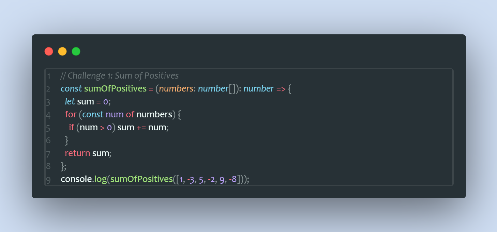
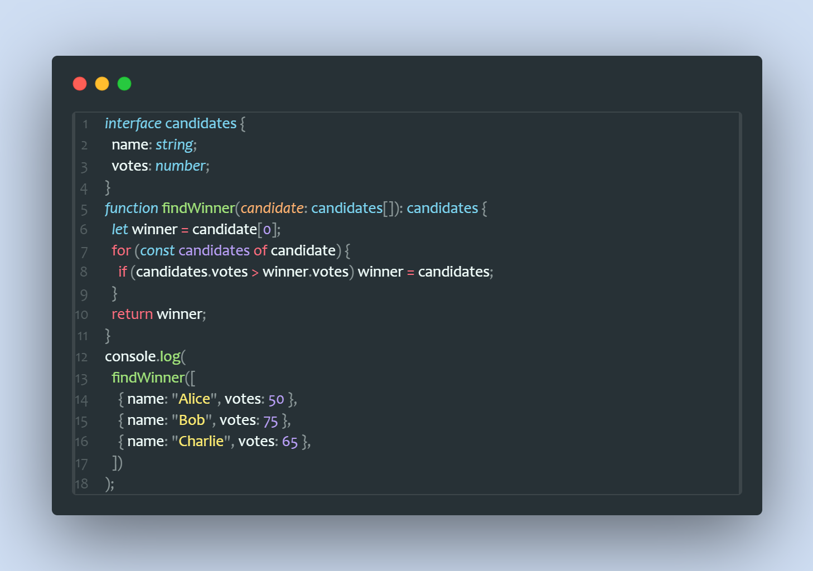

# TypeScript Functions Practices

This repository contains of TypeScript functions that solve various problems. It covers concepts like sum of positives, election winner, truthy count and many more.

Example:



> This code sums up all positive numbers in an array.



> This code finds winner from an array of objects displaying the candidate with the highest number of votes.

## How to Impliment the Codes

1. Clone the repository
1. cd into the typescript-2 folder
1. Open the milestone2.ts
1. Download the required packages to run the code.

Running:

```bash
ts-node milestone2.ts
```
